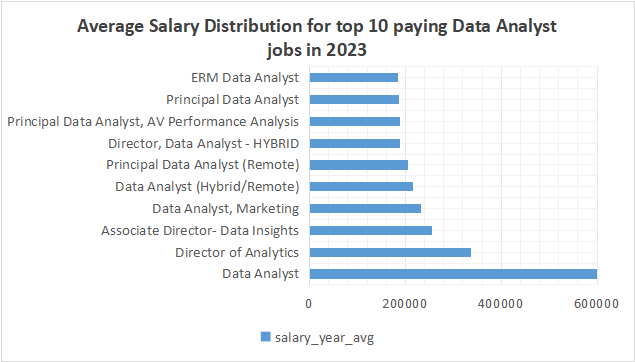
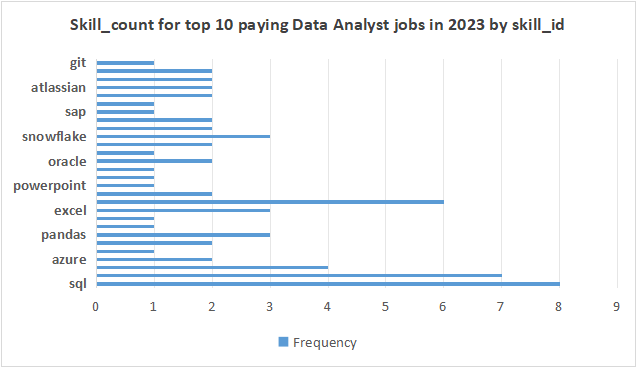
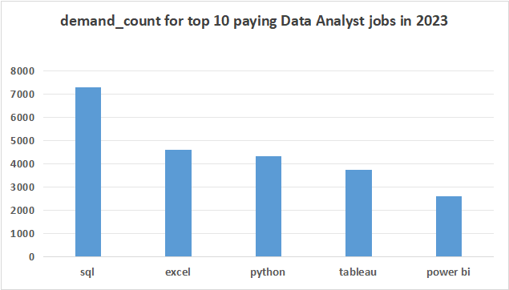
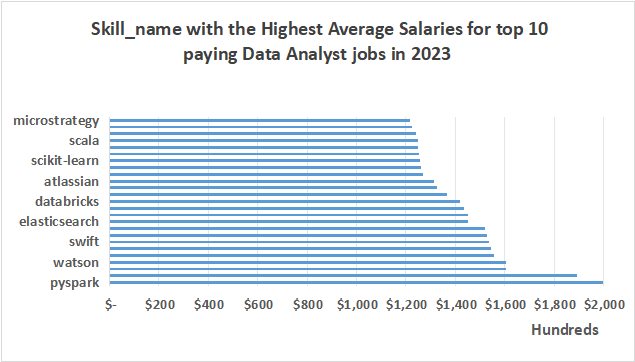
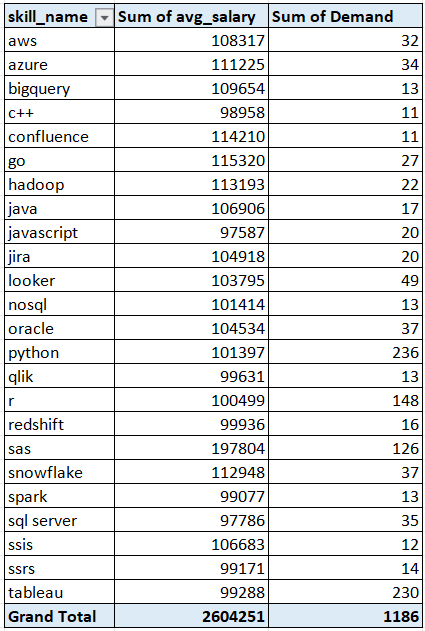

# SQL Project: Data Analyst Job Market Analysis
## Project Overview 
This project analyzes the data analyst job market using SQL, focusing on top-paying jobs, in-demand skills, and salary trends. The analysis is based on job postings data and provides actionable insights for data professionals seeking to optimize their career paths.
The sql queries can be found here: [Project_sql folder](/Project_sql/)
## Key Questions Answered 
1. What are the top-paying data analyst jobs?

2. What skills are most in-demand for data analysts?

3. Which skills are associated with higher salaries?

4. What are the optimal skills to learn (high demand + high salary)?
## Technologies Used

1. Database: PostgreSQL

2. Tools: pgAdmin, VS Code

3. Language: SQL

## Tools Description (Details) ##
**SQL :** Enabled me to extract, join, aggregate, and rank the job-posting data to answer all five analytical questions.

**PostgreSQL :** Provided a reliable and scalable database environment that handled complex joins and aggregations across thousands of records efficiently.

**Visual Studio Code :** Helped to streamline the writing, testing, and formatting of SQL scripts with extensions that connect directly to the database.

**Git & GitHub :** tracked every version of my work and made the complete project shareable and reproducible via a public repository.

# Analysis & Results #
Each query for this project aimed at investigating specific aspects of the "data analyst" job market. Here’s how I approached each question:

## **1️⃣ Top-Paying Data Analyst Jobs** ##
To identify the highest‑paying roles, I filtered data analyst positions by average yearly salary and location, focusing on remote jobs. This query highlights the high‑paying opportunities in the field.
### **Query :** ##

```sql
SELECT
    job_id,
    C.company_id,
    C.name as company_name,
    job_title,
    job_location,
    job_schedule_type,
    salary_year_avg,
    job_posted_date::date
FROM
    job_postings_fact as J
INNER JOIN
    company_dim as C
ON J.company_id=C.company_id
WHERE
    Job_title_short = 'Data Analyst'
AND
    Job_work_from_home = TRUE
AND
    job_location = 'Anywhere'
AND
    Salary_year_avg IS NOT NULL
ORDER BY
    salary_year_avg DESC
LIMIT 10;
```
#### **Here's the breakdown of the top data analyst jobs in 2023:** ####

Wide Salary Range: Top 10 paying data analyst roles span from $184,000 to $650,000, indicating significant salary potential in the field.
Diverse Employers: Companies like SmartAsset, Meta, and AT&T are among those offering high salaries, showing a broad interest across different industries.
Job Title Variety: There's a high diversity in job titles, from Data Analyst to Director of Analytics, reflecting varied roles and specializations within data analytics.



#### **Figure :** #### 

Bar graph visualizing the salary for the top 10 salaries for data analysts; ChatGPT generated this graph from my SQL query results.

## **2️⃣ Skills for Top-Paying Jobs** ##

After identifying the highest-paying roles, I joined those job postings with the skills dimension table to see exactly which technical and analytical skills are required for the most lucrative positions. This query reveals the skill sets that command top-tier salaries.
### **Query :** ## 

```sql
WITH Top_paying_jobs as (
SELECT 
    job_id,
    C.company_id,
    C.name as company_name,
    job_title,
    salary_year_avg
FROM
    job_postings_fact as J
INNER JOIN
    company_dim as C
ON J.company_id=C.company_id
WHERE 
    Job_title_short = 'Data Analyst'
AND
    Job_work_from_home = TRUE 
AND 
    job_location = 'Anywhere'
AND
    Salary_year_avg IS NOT NULL 
ORDER BY 
    salary_year_avg DESC
LIMIT 10
)

Select 
    Top_paying_jobs.*,
    s1.skill_id,
    s2.skills as skill_name,
    s2.type as skill_type
 FROM 
    skills_job_dim as s1
INNER JOIN
    Top_paying_jobs 
ON
    s1.job_id=top_paying_jobs.job_id
Inner JOIN
    skills_dim as s2
ON
    s1.skill_id=s2.skill_id
ORDER BY 
    salary_year_avg DESC;
```

#### **Breakdown of the most demanded skills for the top 10 highest paying data analyst jobs in 2023** ####

SQL is leading with a bold count of 8.
Python follows closely with a bold count of 7.
Tableau is also highly sought after, with a bold count of 6. Other skills like R, Snowflake, Pandas, and Excel show varying degrees of demand.




#### **Figure :** #### 

Bar graph visualizing the count of skills for the top 10 paying jobs for data analysts; ChatGPT generated this graph from my SQL query results

## **3️⃣ In-Demand Skills for Data Analysts** ##
To identify the most frequently required skills, I counted how many times each skill appeared in remote data analyst job postings. This query reveals the core technical competencies employers are actively seeking.

### **Query :** ###
``` sql
With top_demanded_skills as (
Select 
    skill_id,
    count(*) as demand_count
FROM
    skills_job_dim as s1
INNER JOIN
    job_postings_fact as j1
ON 
    s1.job_id=j1.job_id
WHERE
    job_title_short = 'Data Analyst'
AND 
    job_work_from_home = TRUE
GROUP BY 
    skill_id
ORDER BY 
    demand_count DESC
Limit 5
)

Select top_demanded_skills.*,
skills_dim.skills as skill_name,
skills_dim.type as skill_type
 FROM 
    top_demanded_skills
INNER JOIN
    skills_dim
ON
    skills_dim.skill_id=top_demanded_skills.skill_id
ORDER BY 
    demand_count DESC
LIMIT 5;
```

#### **Breakdown of the most demanded skills for data analysts in 2023** ####

* **SQL** and **Excel** remain fundamental, emphasizing the need for strong foundational skills in data processing and spreadsheet manipulation.

* **Programming** and **Visualization Tools** like **Python**, **Tableau**, and **Power BI** are essential, pointing towards the increasing importance of technical skills in data storytelling and decision support.
Skills	Demand Count



#### **Figure :** #### 

Table of the demand for the top 5 skills in data analyst job postings in 2023.

## **4️⃣ Skills with the Highest Average Salaries** ##
To uncover which technical skills command the highest pay, I calculated the average salary associated with each skill for remote data analyst roles. This query identifies lucrative specializations worth pursuing for maximum earning potential

### **Query :** ###
``` sql
Select 
    skills as skill_name,
    type as skill_type,
   Round(avg(salary_year_avg),0) as avg_salary
FROM
    job_postings_fact as j1
INNER JOIN
    skills_job_dim as s1
ON 
    j1.job_id=s1.job_id
INNER JOIN
    skills_dim as s2
ON
    s1.skill_id=s2.skill_id
WHERE
    job_title_short = 'Data Analyst'
AND 
    salary_year_avg IS NOT NULL
AND 
    job_work_from_home = TRUE
GROUP BY 
    skill_name,
    skill_type
ORDER BY 
    avg_salary DESC
Limit 25;
```
#### **Breakdown of the results for top paying skills for Data Analysts:** ####

* **High Demand for Big Data & ML Skills:** Top salaries are commanded by analysts skilled in **big data technologies (PySpark, Couchbase), machine learning tools (DataRobot, Jupyter), and Python libraries (Pandas, NumPy)**, reflecting the industry's high valuation of data processing and predictive modeling capabilities.

* **Software Development & Deployment Proficiency:** Knowledge in **development and deployment tools (GitLab, Kubernetes, Airflow)** indicates a lucrative crossover between data analysis and engineering, with a premium on skills that facilitate automation and efficient data pipeline management.

* **Cloud Computing Expertise:** Familiarity with **cloud and data engineering tools (Elasticsearch, Databricks, GCP)** underscores the growing importance of cloud-based analytics environments, suggesting that cloud proficiency significantly boosts earning potential in data analytics.



#### **Figure :** #### 
Table of the average salary for the top 10 paying skills for data analysts

## 5️⃣ **Optimal Skills (High Demand + High Salary)** ##

To find the best skills to learn for career growth, I combined demand counts with average salaries, filtering for skills that appear in more than 10 postings. This query pinpoints skills that offer both strong job security and high earning potential.

### **Query :** ###
``` sql
WITH skills_demand_count as (
SELECT
   skills_dim.skill_id,
    skills_dim.skills as skill_name,
    skills_dim.type as skill_type,
    count(skills_job_dim.job_id) as skill_count
FROM
    job_postings_fact
INNER JOIN skills_job_dim ON job_postings_fact.job_id = skills_job_dim.job_id
INNER JOIN skills_dim ON skills_job_dim.skill_id=skills_dim.skill_id
WHERE
    job_title_short = 'Data Analyst'
 AND 
    salary_year_avg IS NOT NULL
AND 
    job_work_from_home = TRUE
GROUP BY 
    skills_dim.skill_id
), Average_salary_count as (
    Select 
    skills_job_dim.skill_id,
    skills_dim.skills as skill_name,
    skills_dim.type as skill_type,
   Round(avg(job_postings_fact.salary_year_avg),0) as avg_salary
FROM
    job_postings_fact 
INNER JOIN
    skills_job_dim ON job_postings_fact.job_id=skills_job_dim.job_id
INNER JOIN skills_dim ON skills_job_dim.skill_id=skills_dim.skill_id
WHERE
    job_title_short = 'Data Analyst'
AND 
    salary_year_avg IS NOT NULL
AND 
    job_work_from_home = TRUE
GROUP BY 
    skills_job_dim.skill_id,
     skill_name,
     skill_type
)

SELECT
    skills_demand_count.skill_id,
    skills_demand_count.skill_name,
    skills_demand_count.skill_type,
    skills_demand_count.skill_count,
    average_salary_count.avg_salary
FROM
    skills_demand_count
INNER JOIN
    average_salary_count
ON
    skills_demand_count.skill_id = average_salary_count.skill_id
WHERE
    skill_count > 10
ORDER BY 
    avg_salary DESC,
    skill_count DESC
LIMIT 25;
```
#### **Breakdown of the most optimal skills for Data Analysts in 2023:** ####

* **High-Demand Programming Languages:** Python and R stand out for their high demand, with demand counts of 236 and 148 respectively. Despite their high demand, their average salaries are around $101,397 for Python and $100,499 for R, indicating that proficiency in these languages is highly valued but also widely available.

* **Cloud Tools and Technologies:** Skills in specialized technologies such as Snowflake, Azure, AWS, and BigQuery show significant demand with relatively high average salaries, pointing towards the growing importance of cloud platforms and big data technologies in data analysis.
Business Intelligence and Visualization Tools: Tableau and Looker, with demand counts of 230 and 49 respectively, and average salaries around $99,288 and $103,795, highlight the critical role of data visualization and business intelligence in deriving actionable insights from data.

* **Database Technologies:** The demand for skills in traditional and NoSQL databases (Oracle, SQL Server, NoSQL) with average salaries ranging from $97,786 to $104,534, reflects the enduring need for data storage, retrieval, and management expertise.



#### **Figure :** #### 

Table of the most optimal skills (High demand + High salary) for data analyst sorted by salary

## **What I Learned Through This SQL Project:** ##

* **SQL is the foundation of data analysis**, and mastering advanced techniques like CTEs, multiple joins, and subqueries enables complex, multi-layered insights—from identifying top-paying roles to correlating skills with salaries across thousands of job postings.

* **Demand doesn't always equal high salar:** While SQL and Excel are the most frequently required skills (7,291 and 4,611 mentions respectively), specialized tools like PySpark ($208,172), Go ($115,320), and cloud platforms (Snowflake, Azure) command significantly higher average salaries, proving that niche expertise pays off.

* **The ideal skill set balances popularity with specialization:** SQL, Python, and Tableau are non-negotiable foundational skills for any data analyst, but adding cloud platforms (AWS, Azure, Snowflake) and big data tools (PySpark, Hadoop) can dramatically increase both job opportunities and earning potential.

## **Conclusion** ##
#### **Concluding insights from this project:** ####
* **SQL, Python, and Tableau** are the undisputed foundation skills for any data analyst—appearing in the majority of top-paying jobs (100% of roles) and dominating demand with over 7,000, 4,300, and 3,700 mentions respectively—making them mandatory for career entry and growth.

* **Cloud platforms and big data tools command premium salaries:** Skills like PySpark ($208,172), Snowflake ($112,948), Azure ($111,225), and AWS ($108,317) consistently rank among the highest-paying, while also maintaining strong demand, proving that cloud expertise is the fastest path to six-figure earnings.

* **Visualization and collaboration tools are equally critical:** Tableau and Power BI dominate the analytics space with 3,700+ and 2,600+ mentions, while Jira, Confluence, and Git appear frequently in director-level and principal roles, highlighting that both technical storytelling and teamwork tooling matter for career advancement.

* **Demand doesn't always equal high compensation:** While Excel appears in 4,611 postings, it ranks lower on the salary list ($92,000–$100,000 range), whereas niche skills like Go ($115,320), Hadoop ($113,193), and Databricks ($141,907) offer better salary-to-demand ratios, proving that specialization can be more lucrative than following the crowd.

* ****The optimal skill strategy combines breadth with depth—learning foundational tools (SQL, Python, Tableau):** Ensures job security, while investing in one or two high-value specializations (Snowflake, Azure, PySpark, or Go) can dramatically boost earning potential, creating a powerful combination that maximizes both opportunities and compensation.

## **Closing Thoughts** ##
This project enhanced my SQL skills and provided valuable insights into the data analyst job market. The findings from the analysis serve as a guide to prioritizing skill development and job search efforts for the data analyst role. Aspiring data analysts like me can better position themselves in a competitive job market by focusing on high-demand, high-salary skills. This exploration highlights the importance of continuous learning and adaptation to emerging trends in the field of data analytics.

